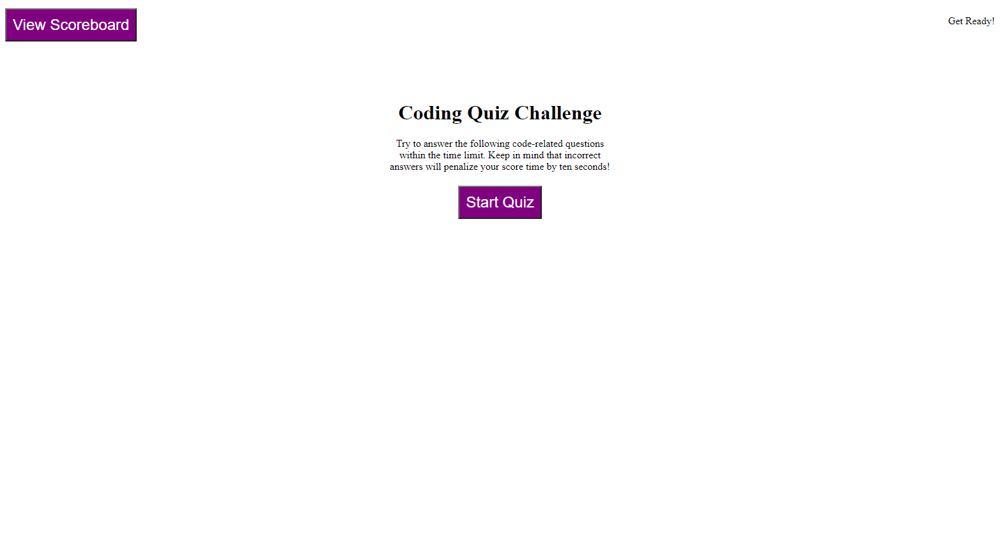
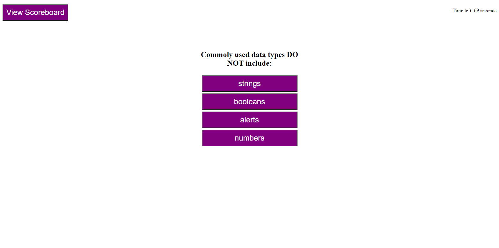
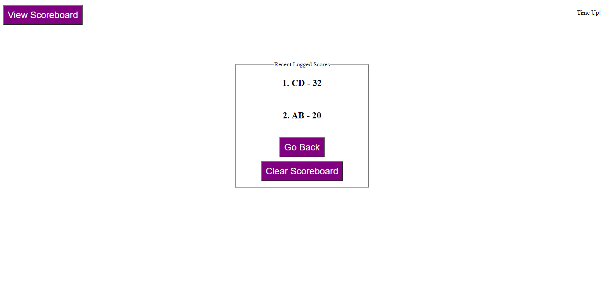

# Project: Coding Quiz
## Deployed Link: 
https://dragontalker.github.io/BootCamp_Project4_CodingQuiz/

## Overview

This project builds a timed coding quiz with multiple-choice questions. This app will run in the browser and will feature dynamically updated HTML and CSS powered by JavaScript code.  For example, once the choice is clicked by user, the built-in JavaScript will automatically constructe new HTML elements and form a new question. Another important feature is countdown timer, which will be penalized for choosing the wrong answer. The last feature is a scoreboard linked to localStorage, once the score is stored, it will still show in the scoreboard as long as user does not clear the localStorage.

## Screenshots

Click 'Start Quiz" button to start the quiz, there are 5 multiple-choice questions in total, given 75 seconds for user to complete.



For each question answered incorrectly, a penalty of 10 seconds will be applied to the timer.



The final score will be equal to the time left, if user answers wrong while timer is less than 10s, user gets a score of 0. After all, user get chance to enter his/her initial to save the score to scoreboard.



## User Story

```
AS A coding boot camp student
I WANT to take a timed quiz on JavaScript fundamentals that stores high scores
SO THAT I can gauge my progress compared to my peers
```

## Acceptance Criteria

```
GIVEN I am taking a code quiz
WHEN I click the start button
THEN a timer starts and I am presented with a question
WHEN I answer a question
THEN I am presented with another question
WHEN I answer a question incorrectly
THEN time is subtracted from the clock
WHEN all questions are answered or the timer reaches 0
THEN the game is over
WHEN the game is over
THEN I can save my initials and my score
```

